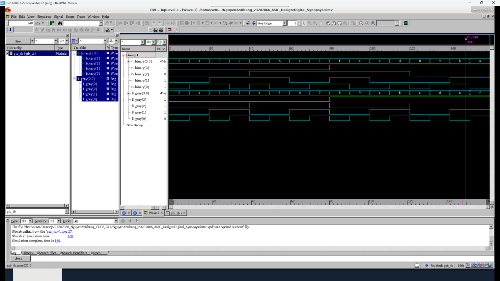

# Gray-to-Binary Converter ASIC

## Project Overview

This project implements a **4-bit Gray-to-Binary Converter** following the ASIC design flow from **Front-end to Back-end**.

The complete design flow includes:

**RTL Design → Functional Verification → Logic Synthesis → Formal Verification → Floorplan → Placement → Routing → DRC/LVS → Post-layout Verification**

---

## Project Objectives

* Design a 4-bit Gray-to-Binary Converter.
* Describe the design using Verilog RTL.
* Perform functional verification.
* Synthesize the RTL design into standard cells.
* Perform formal equivalence verification.
* Implement the physical design.
* Perform DRC and LVS checks.
* Evaluate timing and physical design results.

---

## 🔌 Design Specification

| Signal   | Direction | Width | Description        |
| -------- | --------- | ----: | ------------------ |
| `gray`   | Input     | 4-bit | Gray Code input    |
| `binary` | Output    | 4-bit | Binary Code output |

### Gray-to-Binary Conversion

The conversion is performed according to:

```text
B3 = G3
B2 = B3 ^ G2
B1 = B2 ^ G1
B0 = B1 ^ G0
```

where:

* `G[3:0]` is the Gray Code input.
* `B[3:0]` is the Binary Code output.
* `^` represents the XOR operation.

---

## ASIC Design Flow

### 1. RTL Design

The Gray-to-Binary Converter is described using Verilog RTL.

### Simulation Waveform


The RTL design is verified using test vectors to ensure that the Gray Code is correctly converted to Binary Code.

### 3. Logic Synthesis

The RTL is synthesized using **Synopsys Design Compiler**.

The synthesis process generates a mapped netlist using standard cells from the technology library.

### 4. Formal Verification

Formal equivalence checking is performed using **Synopsys Formality** to verify that the synthesized netlist is functionally equivalent to the original RTL design.

### 5. Floorplan

The physical design is initialized with a target core utilization of 60%.

Due to placement site and grid constraints, the final core utilization is:

```text
Core Utilization = 81.03%
```

### 6. Placement

Standard cells are placed inside the core area and legalization is performed.

Result:

```text
Placement Legality = PASS
Placement Violations = 0
```

### 7. Routing

The design is routed using the available metal layers.

Result:

```text
Routing Overflow = 0%
```

### 8. DRC / LVS

Design Rule Check and Layout Versus Schematic checks are performed after physical implementation.

Results:

```text
DRC Violations = 0
LVS = MATCH
```

---

## 📊 Synthesis Results

| Parameter                  |    Result |
| -------------------------- | --------: |
| Standard Cells             |         4 |
| Leaf Cell Count            |         4 |
| Combinational Cells        |         4 |
| Sequential Cells           |         0 |
| Critical Path              |   0.30 ns |
| TNS                        |      0 ns |
| Design Area                | 12.913265 |
| Cell Area                  | 11.944768 |
| Net Area                   |  0.968496 |
| Max Transition Violations  |         0 |
| Max Capacitance Violations |         0 |

---

## 🔍 Formal Verification

Formal verification result:

```text
Verification: SUCCEEDED
Passing Compare Points: 4
Failing Compare Points: 0
```

The synthesized implementation is functionally equivalent to the original RTL design.

---

## 📐 Back-end Results

| Parameter        |       Result |
| ---------------- | -----------: |
| Core Utilization |       81.03% |
| Cell Area        |    11.94 µm² |
| Physical Area    |    11.95 µm² |
| Total Area       |    14.74 µm² |
| Standard Cells   |            4 |
| Nets             |           10 |
| Routing Overflow |           0% |
| DRC              | 0 Violations |
| LVS              |        Match |
| Setup Timing     |         PASS |
| Hold Timing      |         PASS |
| Timing Sign-off  |         PASS |

---

## ⏱️ Timing Results

| Parameter         |    Result |
| ----------------- | --------: |
| Clock Period      |     20 ns |
| Frequency         |    50 MHz |
| Critical Path     |   0.30 ns |
| WNS (Setup Slack) | +19.70 ns |
| TNS               |      0 ns |
| Timing Sign-off   |      PASS |

---

## 📁 Project Structure

```text
Gray-to-Binary-Converter-ASIC/
│
├── README.md
│
├── RTL/
│   ├── gray_to_binary.v
│   └── gray_to_binary_tb.v
│
├── Synthesis/
│   ├── scripts/
│   ├── reports/
│   └── netlist/
│
├── Verification/
│   ├── simulation/
│   └── formality/
│
├── Backend/
│   ├── scripts/
│   ├── reports/
│   ├── floorplan/
│   ├── placement/
│   └── routing/
│
└── Results/
    ├── waveform/
    ├── schematic/
    ├── floorplan/
    ├── placement/
    ├── routing/
    └── DRC_LVS/
```

---

## 🛠️ Tools

* Verilog
* Synopsys Design Compiler
* Synopsys Formality
* Synopsys Physical Design Tools
* ASIC Standard Cell Library
* Simulation / Waveform Analysis

---

## 👨‍💻 Authors

**Bùi Quang Hiếu**
Student ID: `23207053`

**Nguyễn An Khang**
Student ID: `23207066`

**Class:** `23DTV_CLC2 - CA1`

**Course:** Thực hành thiết kế vi mạch điện tử

**Project:** Thiết kế và hiện thực ASIC – Gray-to-Binary Converter

---

## ✅ Final Result

The 4-bit Gray-to-Binary Converter successfully completed the ASIC design flow from RTL to physical implementation.

Final verification results:

```text
RTL Simulation       : PASS
Functional Verification : PASS
Logic Synthesis      : PASS
Formal Verification  : PASS
Placement            : PASS
Routing              : PASS
DRC                  : PASS
LVS                  : PASS
Setup Timing         : PASS
Hold Timing          : PASS
Timing Sign-off      : PASS
```

